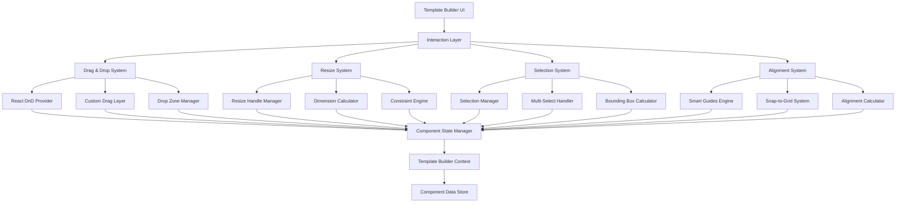

# Design Document

## Overview

This design document outlines the architecture and implementation approach for enhancing the template builder with Figma-inspired drag and drop functionality and advanced resizable component capabilities. The solution focuses on creating a professional-grade visual building experience through smooth interactions, intelligent visual feedback, and precision controls.

The design leverages React's ecosystem with Framer Motion for animations, react-dnd for drag operations, and custom interaction handlers to create a cohesive, performant interface that rivals modern design tools.

## Architecture

### High-Level Architecture



### Core Systems Integration

The enhanced template builder integrates several specialized systems:

1. **Interaction Layer**: Coordinates all user interactions and manages interaction states
2. **Drag & Drop System**: Handles component dragging with visual feedback and smart positioning
3. **Resize System**: Manages component resizing with constraints and visual feedback
4. **Selection System**: Handles single and multi-component selection with unified operations
5. **Alignment System**: Provides smart guides, snapping, and alignment tools
6. **Performance Layer**: Optimizes rendering and interaction performance

## Components and Interfaces

### Enhanced Drag and Drop Components

#### `EnhancedDragLayer`
```typescript
interface EnhancedDragLayerProps {
  zoom: number;
  showPreview: boolean;
  showMeasurements: boolean;
}

interface DragPreviewData {
  componentType: string;
  dimensions: { width: number; height: number };
  position: { x: number; y: number };
  isMultiSelect: boolean;
  componentCount: number;
}
```

Replaces the basic `CustomDragLayer` with advanced preview capabilities including:
- High-fidelity component previews during drag
- Multi-component drag visualization
- Real-time measurement overlays
- Smooth animation transitions

#### `SmartDropZone`
```typescript
interface SmartDropZoneProps {
  onDrop: (item: DragItem, position: Position) => void;
  showGuides: boolean;
  snapToGrid: boolean;
  gridSize: number;
  components: ComponentData[];
}

interface DropZoneState {
  isActive: boolean;
  nearestSnapPoints: SnapPoint[];
  alignmentGuides: AlignmentGuide[];
  dropPreview: DropPreview | null;
}
```

Enhanced drop zone that provides:
- Intelligent snap-to-grid functionality
- Real-time alignment guide generation
- Drop preview with positioning feedback
- Conflict detection and resolution

### Advanced Resize System

#### `PrecisionResizeHandle`
```typescript
interface PrecisionResizeHandleProps {
  direction: ResizeDirection;
  onResize: (delta: ResizeDelta, constraints: ResizeConstraints) => void;
  onResizeEnd: (finalDimensions: Dimensions) => void;
  showDimensions: boolean;
  maintainAspectRatio: boolean;
  resizeFromCenter: boolean;
}

type ResizeDirection = 
  | 'n' | 's' | 'e' | 'w' 
  | 'ne' | 'nw' | 'se' | 'sw'
  | 'rotate';

interface ResizeConstraints {
  minWidth: number;
  minHeight: number;
  maxWidth?: number;
  maxHeight?: number;
  aspectRatio?: number;
  snapToGrid: boolean;
}
```

Advanced resize handles that provide:
- 8-directional resizing (corners + edges)
- Real-time dimension feedback
- Constraint-based resizing
- Aspect ratio preservation
- Center-point resizing

#### `DimensionFeedback`
```typescript
interface DimensionFeedbackProps {
  component: ComponentData;
  isResizing: boolean;
  showTooltip: boolean;
  position: 'top' | 'bottom' | 'left' | 'right';
}
```

Floating dimension display that shows:
- Current width and height values
- Delta changes during resize
- Constraint violations
- Snap-to-grid indicators

### Multi-Selection System

#### `SelectionManager`
```typescript
interface SelectionManagerProps {
  components: ComponentData[];
  selectedIds: string[];
  onSelectionChange: (selectedIds: string[]) => void;
  selectionMode: 'single' | 'multi' | 'rectangle';
}

interface SelectionState {
  boundingBox: BoundingBox;
  selectionHandles: SelectionHandle[];
  groupOperations: GroupOperation[];
}

interface BoundingBox {
  x: number;
  y: number;
  width: number;
  height: number;
  rotation: number;
}
```

Manages complex selection scenarios:
- Rectangle selection with visual feedback
- Shift-click multi-selection
- Unified bounding box for multiple components
- Group operations (move, resize, rotate)

#### `RectangleSelector`
```typescript
interface RectangleSelectorProps {
  onSelectionComplete: (selectedComponents: string[]) => void;
  isActive: boolean;
  components: ComponentData[];
}
```

Implements marquee selection:
- Visual selection rectangle
- Real-time component highlighting
- Intersection detection
- Smooth animation feedback

### Smart Alignment System

#### `AlignmentGuideEngine`
```typescript
interface AlignmentGuideEngineProps {
  activeComponent: ComponentData;
  allComponents: ComponentData[];
  snapThreshold: number;
  showDistanceMeasurements: boolean;
}

interface AlignmentGuide {
  type: 'horizontal' | 'vertical';
  position: number;
  components: string[];
  snapStrength: number;
}

interface DistanceMeasurement {
  from: ComponentData;
  to: ComponentData;
  distance: number;
  direction: 'horizontal' | 'vertical';
}
```

Provides intelligent alignment:
- Real-time guide generation
- Multi-component alignment detection
- Distance measurements
- Snap-to-alignment functionality

#### `SnapEngine`
```typescript
interface SnapEngineProps {
  components: ComponentData[];
  activeComponentId: string;
  snapToGrid: boolean;
  snapToComponents: boolean;
  gridSize: number;
  snapThreshold: number;
}

interface SnapResult {
  position: Position;
  snappedTo: SnapTarget[];
  guides: AlignmentGuide[];
}

type SnapTarget = 
  | { type: 'grid'; position: Position }
  | { type: 'component'; componentId: string; edge: EdgeType }
  | { type: 'center'; componentId: string };
```

Advanced snapping system:
- Grid-based snapping
- Component edge snapping
- Center-point alignment
- Multi-target snapping

## Data Models

### Enhanced Component Data

```typescript
interface EnhancedComponentData extends ComponentData {
  // Existing properties
  id: string;
  content: ComponentId;
  props: Record<string, any>;
  x: number;
  y: number;
  width: number;
  height: number;
  zIndex: number;
  visible: boolean;
  locked: boolean;
  rotation: number;
  
  // New properties for enhanced functionality
  constraints: ComponentConstraints;
  interactions: InteractionState;
  metadata: ComponentMetadata;
}

interface ComponentConstraints {
  minWidth: number;
  minHeight: number;
  maxWidth?: number;
  maxHeight?: number;
  maintainAspectRatio: boolean;
  snapToGrid: boolean;
  lockAspectRatio?: number;
}

interface InteractionState {
  isDragging: boolean;
  isResizing: boolean;
  isSelected: boolean;
  isHovered: boolean;
  lastInteraction: Date;
}

interface ComponentMetadata {
  createdAt: Date;
  modifiedAt: Date;
  version: number;
  tags: string[];
  description?: string;
}
```

### Selection and Interaction Models

```typescript
interface SelectionState {
  selectedComponentIds: string[];
  selectionMode: SelectionMode;
  boundingBox: BoundingBox | null;
  lastSelectedId: string | null;
  selectionHistory: string[][];
}

type SelectionMode = 'single' | 'multi' | 'rectangle' | 'lasso';

interface InteractionContext {
  currentTool: Tool;
  modifierKeys: ModifierKeys;
  interactionState: InteractionState;
  performanceMode: PerformanceMode;
}

type Tool = 'select' | 'move' | 'resize' | 'rotate' | 'measure';

interface ModifierKeys {
  shift: boolean;
  ctrl: boolean;
  alt: boolean;
  meta: boolean;
}

type PerformanceMode = 'high-quality' | 'performance' | 'auto';
```

## Error Handling

### Interaction Error Recovery

```typescript
interface InteractionError {
  type: 'drag' | 'resize' | 'selection' | 'alignment';
  message: string;
  componentId?: string;
  recoveryAction: RecoveryAction;
}

type RecoveryAction = 
  | { type: 'retry'; maxAttempts: number }
  | { type: 'reset'; resetTo: 'lastKnownGood' | 'initial' }
  | { type: 'ignore'; continueOperation: boolean };
```

Error handling strategies:
- Graceful degradation for performance issues
- Automatic recovery from invalid states
- User notification for critical errors
- Rollback capabilities for failed operations

### Constraint Violation Handling

```typescript
interface ConstraintViolation {
  componentId: string;
  violationType: 'size' | 'position' | 'overlap' | 'boundary';
  severity: 'warning' | 'error';
  suggestedFix: ConstraintFix;
}

interface ConstraintFix {
  description: string;
  autoApply: boolean;
  action: () => void;
}
```

## Testing Strategy

### Unit Testing Focus Areas

1. **Drag and Drop Logic**
   - Position calculations
   - Snap-to-grid functionality
   - Multi-component dragging
   - Drop zone detection

2. **Resize Calculations**
   - Dimension constraints
   - Aspect ratio preservation
   - Multi-component resizing
   - Boundary detection

3. **Selection Management**
   - Rectangle selection algorithms
   - Multi-selection state management
   - Bounding box calculations
   - Selection persistence

4. **Alignment Engine**
   - Guide generation algorithms
   - Snap threshold calculations
   - Distance measurements
   - Performance optimization

### Integration Testing

1. **Cross-System Interactions**
   - Drag-to-resize workflows
   - Selection-to-alignment operations
   - Multi-tool interactions
   - State synchronization

2. **Performance Testing**
   - Large component count scenarios
   - Complex interaction sequences
   - Memory usage optimization
   - Rendering performance

### User Experience Testing

1. **Interaction Responsiveness**
   - Sub-60ms interaction feedback
   - Smooth animation performance
   - Visual feedback accuracy
   - Error state handling

2. **Accessibility Compliance**
   - Keyboard navigation support
   - Screen reader compatibility
   - High contrast mode support
   - Focus management

## Performance Considerations

### Rendering Optimization

1. **Virtual Rendering**
   - Off-screen component culling
   - Level-of-detail rendering
   - Interaction-based quality scaling

2. **Animation Performance**
   - Hardware acceleration utilization
   - Frame rate monitoring
   - Adaptive quality adjustment

3. **Memory Management**
   - Component instance pooling
   - Event listener cleanup
   - State history pruning

### Interaction Optimization

1. **Event Throttling**
   - Mouse move event throttling
   - Resize calculation batching
   - Guide generation debouncing

2. **Computational Efficiency**
   - Spatial indexing for collision detection
   - Cached calculation results
   - Incremental update strategies

This design provides a comprehensive foundation for implementing Figma-inspired drag and drop functionality while maintaining high performance and user experience standards.