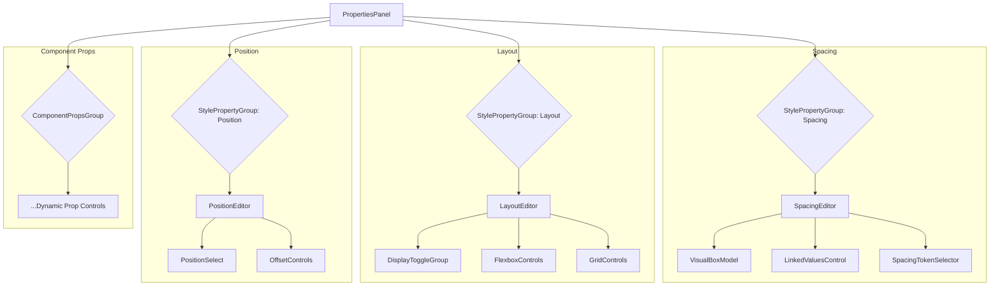
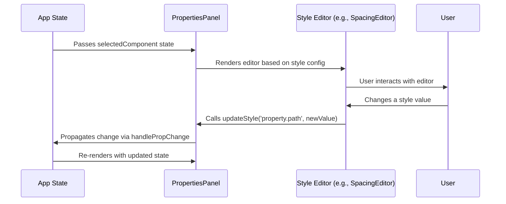

# Properties Panel Redesign: Architectural Plan

This document outlines the architectural plan for redesigning the properties panel to incorporate new features for spacing, layout, and positioning.

## 1. Analysis of Existing Implementation

The current implementation consists of a main `PropertiesPanel` component with several visual editors. Here's a breakdown of the key files and my analysis:

*   **`components/PropertiesPanel.tsx`**: This component serves as the primary container. It dynamically renders controls based on a Zod schema (`propsDefinition`) for component-specific props. However, the "Layout" section, which contains styling controls, is hardcoded. This makes it inflexible and difficult to extend. The way style properties are updated is inconsistent across different editors. The collapsible group structure is a good feature to retain.

*   **`components/visual-editors/MarginPaddingEditor.tsx`**: This provides a basic visual representation of the box model for margin and padding. It lacks the required new features such as linking values, drag-to-adjust functionality, and support for spacing tokens. It will need to be completely replaced.

*   **`components/visual-editors/FlexGridEditor.tsx`**: This component offers simple toggles for `display` and text-based buttons for flexbox properties. The grid controls are limited to basic column and row count inputs. This component needs a significant overhaul to meet the requirements for intuitive, icon-based controls and a visual grid editor.

*   **`lib/component-props.ts`**: This file provides a good, declarative structure for defining component-specific props. However, it does not cover style properties. The new architecture should introduce a similar declarative approach for managing style properties.

## 2. Proposed Component Hierarchy

The new properties panel will be more modular and data-driven. The proposed component hierarchy is as follows:

## 3. Data Flow and State Management

The proposed data flow aims for consistency and a single source of truth.

*   **State Management**: The `selectedComponent` object, containing its `props` and `style` attributes, will remain the single source of truth, managed outside the `PropertiesPanel`.

*   **Unified Style Updates**: A unified callback, `updateStyle(property: string, value: any)`, will be used for all style modifications. For nested properties, a dot notation path will be used (e.g., `margin.top`).

*   **Declarative Style Definitions**: A new file, `lib/style-props.ts`, will be created to define the configuration for style property groups (e.g., Spacing, Layout). This will make the `PropertiesPanel` data-driven and easier to extend. Each definition will specify the editor component to use for that property.

Here is a diagram illustrating the data flow:

## 4. New and Modified Components

### New Components

*   **`SpacingEditor.tsx`**: A new visual editor for margin and padding with linking, drag-to-adjust functionality, and a spacing token selector.
*   **`LayoutEditor.tsx`**: A new container for all layout-related controls.
*   **`FlexboxControls.tsx`**: An icon-based editor for flexbox properties (`flex-direction`, `justify-content`, `align-items`, `flex-wrap`).
*   **`GridControls.tsx`**: A visual editor for CSS Grid layout properties.
*   **`PositionEditor.tsx`**: A component for managing the `position` property and its offset values.
*   **`StylePropertyGroup.tsx`**: A generic component that renders a collapsible group of style controls based on a configuration object.

### Modified Components

*   **`PropertiesPanel.tsx`**: Will be refactored to use `StylePropertyGroup` and the new editor components. The hardcoded layout section will be removed, and the panel will be driven by the new `lib/style-props.ts` configuration.

### Deprecated Components

*   **`components/visual-editors/MarginPaddingEditor.tsx`**: To be replaced by `SpacingEditor.tsx`.
*   **`components/visual-editors/FlexGridEditor.tsx`**: To be replaced by `LayoutEditor.tsx`.