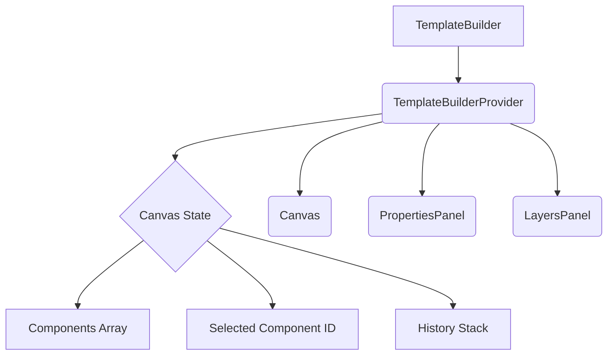
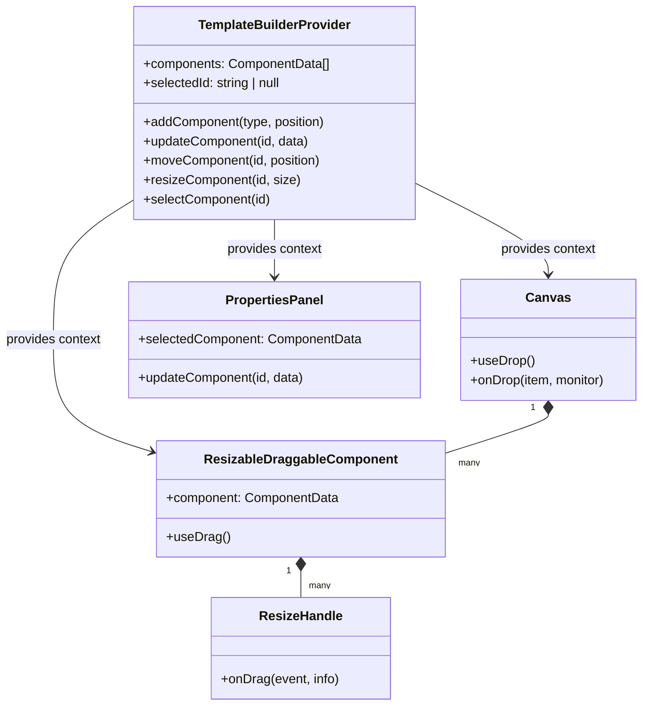

# DND Refactor Plan: `react-dnd` & `framer-motion`

This document outlines the architectural plan for refactoring the template builder's drag-and-drop and interactivity features. The goal is to create a more robust, maintainable, and user-friendly system using `react-dnd` for drag-and-drop logic and `framer-motion` for animations and interactivity.

## 1. Core Architectural Changes

### 1.1. State Management with `TemplateBuilderContext`

The current monolithic `appReducer` will be broken down. A new `TemplateBuilderContext` will be introduced to manage the state of the canvas components, including their positions, sizes, and other properties.

**Responsibilities of `TemplateBuilderContext`:**

*   Managing the `components` array (the state for all elements on the canvas).
*   Providing actions to `add`, `update`, `move`, and `resize` components.
*   Handling component selection and history (undo/redo).

This will decouple the canvas state from the main application state, making the system easier to reason about and test.



### 1.2. Component Structure

The current `CanvasComponent` will be replaced by a new, more specialized set of components.

*   **`ResizableDraggableComponent`**: This will be the main component rendered on the canvas. It will wrap the user's component (e.g., a button or text block) and provide the resizing and dragging functionality.
*   **`ResizeHandle`**: A sub-component of `ResizableDraggableComponent` that will be rendered at the corners and edges of the component to enable resizing.
*   **`Canvas`**: The main drop target area. It will be responsible for handling the dropping of new components from the sidebar and for providing the context for component positioning.

## 2. `react-dnd` Integration Strategy

### 2.1. `DndProvider`

The entire `TemplateBuilder` will be wrapped in the `DndProvider` from `react-dnd` to enable drag-and-drop functionality throughout the component tree.

```tsx
// app/template-builder/layout.tsx
import { DndProvider } from 'react-dnd';
import { HTML5Backend } from 'react-dnd-html5-backend';

export default function TemplateBuilderLayout({ children }: { children: React.ReactNode }) {
  return (
    <DndProvider backend={HTML5Backend}>
      {children}
    </DndProvider>
  );
}
```

### 2.2. Drag Sources

*   **`SidebarComponent`**: Will use the `useDrag` hook to allow new components to be dragged onto the canvas. The `item` being dragged will contain the component's `type`.
*   **`ResizableDraggableComponent`**: Will use the `useDrag` hook to allow existing components to be moved around the canvas. The `item` will contain the component's `id` and its current `x` and `y` coordinates.

### 2.3. Drop Targets

*   **`Canvas`**: Will use the `useDrop` hook to accept both new components from the sidebar and existing components being moved.
    *   **Accurate Drop Positioning**: On drop, we will use the monitor's `getClientOffset()` method to get the exact mouse coordinates relative to the viewport. We will then subtract the canvas's own offset to get the precise drop position within the canvas. This will be more reliable than the current delta-based calculation.
*   **`ResizableDraggableComponent`**: Will *not* be a drop target itself to prevent nesting components, simplifying the logic.

## 3. Resizable Components with `framer-motion`

### 3.1. `ResizableDraggableComponent` Design

This component will use `framer-motion`'s `motion.div` for its root element. This will allow us to animate its position and size.

```tsx
// components/ResizableDraggableComponent.tsx
import { motion, useDragControls } from 'framer-motion';

const ResizableDraggableComponent = ({ component }) => {
  const dragControls = useDragControls();

  return (
    <motion.div
      drag
      dragControls={dragControls}
      dragListener={false} // We'll start drag from a specific handle
      style={{ x: component.x, y: component.y, width: component.width, height: component.height }}
      animate={{ x: component.x, y: component.y, width: component.width, height: component.height }}
      transition={{ type: 'spring', stiffness: 300, damping: 30 }}
    >
      {/* The actual component content */}
      <UserComponent {...component.props} />

      {/* Resize Handles */}
      <ResizeHandle position="top-left" />
      <ResizeHandle position="top-right" />
      <ResizeHandle position="bottom-left" />
      <ResizeHandle position="bottom-right" />
    </motion.div>
  );
};
```

### 3.2. `ResizeHandle` Implementation

The `ResizeHandle` components will also be `motion.div` elements. They will use `framer-motion`'s `drag` prop to handle the resizing logic.

```tsx
// components/ResizeHandle.tsx
import { motion } from 'framer-motion';

const ResizeHandle = ({ onResize }) => {
  return (
    <motion.div
      drag
      onDrag={onResize}
      className="resize-handle"
    />
  );
};
```

When a `ResizeHandle` is dragged, its `onDrag` event will fire. This event will provide the offset of the drag, which we can use to calculate the new width and height of the parent `ResizableDraggableComponent` and update its state in the `TemplateBuilderContext`.

## 4. Animation Strategy with `framer-motion`

*   **Dragging Animation**: When a component is dragged, we will use `framer-motion` to smoothly lift it and apply a subtle shadow and scale effect.
*   **Drop Animation**: When a component is dropped, it will animate into its final position with a spring animation.
*   **Resize Animation**: As a component is resized, the change in width and height will be animated smoothly.
*   **Layout Animations**: We will use `framer-motion`'s `AnimatePresence` and `layout` prop to automatically animate components when they are added, removed, or reordered.

## 5. Proposed State Management Structure



## 6. Summary of Plan

1.  **Refactor State:** Create a `TemplateBuilderContext` to manage canvas state.
2.  **New Component Architecture:** Introduce `ResizableDraggableComponent` and `ResizeHandle` components.
3.  **`react-dnd` for DnD:** Use `useDrag` for sidebar and canvas components, and `useDrop` on the main canvas.
4.  **`framer-motion` for Interactivity:** Use `motion.div` for dragging, resizing, and animations.
5.  **Accurate Positioning:** Use `monitor.getClientOffset()` for precise drop coordinates.
6.  **Enhanced Animations:** Implement smooth, spring-based animations for all interactions.

This plan will result in a more modular, performant, and feature-rich template builder that meets all the requirements of the task.